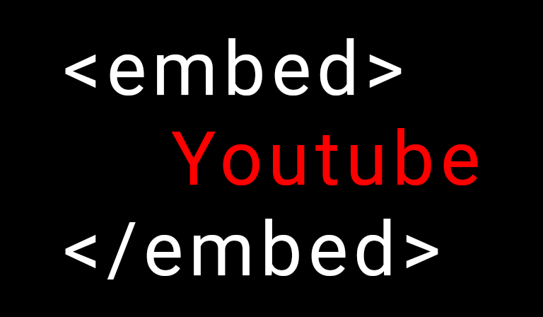

# YouTube Embedded

>
> Why? Because there's a loop hole.
>

## What is This?

YouTube embedded videos do not run the anti-ad blocker code.
This allows you to play any _non-age restricted_ video through an embedded player.

## How Do I Use This?

**A Fair Warning:** YouTube could view the use of this HTML, CSS, and JS file almost anyone could make as violating it's terms of service. You are using this at your own risk and YouTube may, at any time, render it inoperable. The intention behind this repository is simply to demonstrate that the web is not as restricted as many companies report.

1. Star this repository.
1. Clone this repo _or_ download the latest `.zip` from [Releases](https://github.com/Sorcerio/YouTube-Embedded/releases).
1. Open your local [./youtube.html](./youtube.html) file in your browser.
1. Supply an input as a video url or JSON playlist.
    * Examples are provided in the UI.
1. Enjoy your video.
